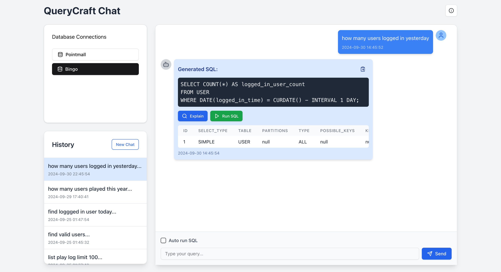

# QueryCraft

QueryCraft is an AI-powered tool that helps you generate and execute SQL queries using natural language. It's designed to make database querying more accessible and efficient for both beginners and experienced users.




## Features

- Natural Language to SQL: Convert your plain English(Japanese and more) questions into SQL queries.
- Multi-Database Support: Works with MySQL, PostgreSQL, and MariaDB.
- Interactive Chat Interface: Engage in a conversation to refine your queries.
- Query History: Keep track of your past queries and results.
- SQL Execution: Run generated SQL queries directly from the interface.
- Result Visualization: View query results in a formatted table.
- Conversation Management: Start new conversations or continue previous ones.

## Tech Stack

- Next.js
- React
- TypeScript
- Tailwind CSS
- Radix UI

## Prerequisites

Before you begin, ensure you have met the following requirements:

- Node.js (v14 or later)
- npm (v6 or later)
- A MySQL database (or PostgreSQL/MariaDB, depending on your configuration)

## Installation

1. Clone the repository

2. Enter the project directory and install the dependencies:

   ```
    npm install
    
   ```

3. Set up your environment variables:
   Create a `.env` file(or use template file: .env.template ) in the root directory and add the following:
   ```
    AZURE_OPENAI_ENDPOINT=
    AZURE_OPENAI_API_KEY=
    AZURE_OPENAI_DEPLOYMENT_ID=

   ```


## Usage

1. Start the development server:
   ```
   npm run dev
   ```
   OR use Docker
   ```
   docker build -t querycraft .   
   ``` 
   ```
   docker run -p 3000:3000 querycraft    
   ``` 

2. Open your browser and navigate to `http://localhost:3000`.

3. After app start, input the following in settings page

    * The System prompt(for Azure AI) and Database Schema
    * DB connection config(Multiple connections supported)

4. Use the chat interface to enter your database queries in natural language.

5. View the generated SQL, execute queries, and see the results directly in the interface.


## Deploy

Deploy to server using PM2(https://pm2.io/docs/runtime/guide/installation/):

   ```
   sudo npm install pm2 -g
   npm run build
   pm2 start "npm run start" --name 'QueryCraft'
   ```


## Contact

If you have any questions or feedback, please open an issue on this GitHub repository.

